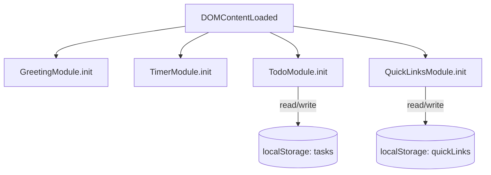

# Design Document: To-Do List Dashboard

## Overview

A single-page, client-side productivity dashboard built with vanilla HTML/CSS/JS. No frameworks, no backend. All state is persisted in Local Storage. The app is structured as three files: `index.html`, `css/styles.css`, and `js/app.js`.

The four main components — Greeting, Focus Timer, To-Do List, and Quick Links — are independent modules initialized on `DOMContentLoaded`. They share no state with each other and communicate only through the DOM and Local Storage.

---

## Architecture

```
index.html
├── <link> css/styles.css
└── <script> js/app.js
    ├── greeting.js (module pattern, IIFE)
    ├── timer.js
    ├── todo.js
    └── quicklinks.js
```

Since the constraint is a single JS file, `js/app.js` contains all four modules as self-contained objects/IIFEs, initialized at the bottom via `DOMContentLoaded`.



---

## Components and Interfaces

### GreetingModule

Owns the greeting text, time, and date display. Uses `setInterval` at 1000ms.

```js
const GreetingModule = {
  init(),                        // start interval, render immediately
  _tick(),                       // called every second
  _getGreeting(hour: number): string,  // returns greeting string
  _formatTime(date: Date): string,     // "3:45 PM"
  _formatDate(date: Date): string,     // "Monday, July 14, 2025"
  _render(greeting, time, date)
}
```

### TimerModule

Manages a 25-minute countdown. State is kept in memory only (not persisted).

```js
const TimerModule = {
  init(),
  start(),
  stop(),
  reset(),
  _tick(),                        // decrements _remaining, updates display
  _formatTime(seconds: number): string,  // "MM:SS"
  _render(),
  _intervalId: null,
  _remaining: 1500,               // seconds
  _running: false
}
```

### TodoModule

Manages task CRUD and persistence.

```js
const TodoModule = {
  init(),
  _load(): Task[],                // reads from localStorage
  _save(tasks: Task[]),           // writes to localStorage
  _addTask(text: string),
  _deleteTask(id: string),
  _toggleTask(id: string),
  _editTask(id: string, newText: string),
  _render(tasks: Task[]),
  _tasks: []
}
```

### QuickLinksModule

Manages link CRUD and persistence.

```js
const QuickLinksModule = {
  init(),
  _load(): Link[],
  _save(links: Link[]),
  _addLink(label: string, url: string),
  _removeLink(id: string),
  _render(links: Link[]),
  _links: []
}
```

---

## Data Models

### Task

```js
{
  id: string,          // crypto.randomUUID() or Date.now().toString()
  text: string,        // task description, non-empty
  completed: boolean,
  createdAt: number    // Unix timestamp ms
}
```

Stored in `localStorage` under key `"tasks"` as a JSON array.

### Link

```js
{
  id: string,
  label: string,       // display name
  url: string          // full URL including protocol
}
```

Stored in `localStorage` under key `"quickLinks"` as a JSON array.

---

## Correctness Properties

*A property is a characteristic or behavior that should hold true across all valid executions of a system — essentially, a formal statement about what the system should do. Properties serve as the bridge between human-readable specifications and machine-verifiable correctness guarantees.*


### Property 1: Greeting maps all hours correctly

*For any* hour value in [0, 23], `_getGreeting(hour)` SHALL return exactly one of the four defined greeting strings, and the returned string SHALL match the correct time range (5–11 → "Good Morning", 12–16 → "Good Afternoon", 17–20 → "Good Evening", 21–23 and 0–4 → "Good Night").

**Validates: Requirements 1.3**

---

### Property 2: Time formatting produces valid output

*For any* integer number of seconds in [0, 1499], `_formatTime(seconds)` SHALL return a string matching the pattern `MM:SS` where MM is in [00, 24] and SS is in [00, 59]. Similarly, *for any* `Date` object, `_formatTime(date)` (greeting variant) SHALL return a string matching 12-hour format with AM/PM suffix.

**Validates: Requirements 1.1, 2.1**

---

### Property 3: Timer reset always restores initial state

*For any* timer state (running or stopped, any remaining value), calling `reset()` SHALL set `_remaining` to 1500 and `_running` to false.

**Validates: Requirements 2.2**

---

### Property 4: Adding a valid task grows the list

*For any* task list and any non-empty, non-whitespace string, calling `_addTask(text)` SHALL increase the task list length by exactly 1 and the new task SHALL be retrievable by its id with the original text and `completed: false`.

**Validates: Requirements 3.1**

---

### Property 5: Whitespace-only task text is rejected

*For any* string composed entirely of whitespace characters (spaces, tabs, newlines), calling `_addTask(text)` SHALL leave the task list unchanged.

**Validates: Requirements 3.2**

---

### Property 6: Deleting a task removes it from the list

*For any* task list containing at least one task, calling `_deleteTask(id)` with a valid id SHALL produce a list that contains no task with that id, and all other tasks SHALL remain unchanged.

**Validates: Requirements 3.3**

---

### Property 7: Toggling task completion is a round-trip

*For any* task, calling `_toggleTask(id)` twice SHALL return the task to its original `completed` state.

**Validates: Requirements 3.4**

---

### Property 8: Editing a task updates only the target

*For any* task list and any valid new text, calling `_editTask(id, newText)` SHALL update only the task with the matching id, and all other tasks SHALL be identical to their pre-edit state.

**Validates: Requirements 3.5**

---

### Property 9: Task persistence is a round-trip

*For any* array of Task objects, calling `_save(tasks)` followed by `_load()` SHALL return an array that is deeply equal to the original (same ids, texts, completed flags, and createdAt values).

**Validates: Requirements 3.6, 3.7**

---

### Property 10: Adding a valid link grows the links list

*For any* links list and any non-empty label and URL, calling `_addLink(label, url)` SHALL increase the links list length by exactly 1 and the new link SHALL be retrievable by its id with the original label and url.

**Validates: Requirements 4.1**

---

### Property 11: Removing a link removes it from the list

*For any* links list containing at least one link, calling `_removeLink(id)` with a valid id SHALL produce a list that contains no link with that id, and all other links SHALL remain unchanged.

**Validates: Requirements 4.2**

---

### Property 12: Link persistence is a round-trip

*For any* array of Link objects, calling `_save(links)` followed by `_load()` SHALL return an array that is deeply equal to the original (same ids, labels, and urls).

**Validates: Requirements 4.4**

---

## Error Handling

| Scenario | Handling |
|---|---|
| `localStorage` unavailable (private mode, quota exceeded) | Wrap all `localStorage` calls in try/catch; fall back to in-memory state silently |
| Corrupt JSON in `localStorage` | `JSON.parse` in try/catch; return empty array `[]` on failure |
| Empty/whitespace task text | Validate before `_addTask`; show inline error or no-op |
| Invalid URL for quick link | Basic `URL` constructor validation; reject if throws |
| Timer already running on `start()` | Guard with `_running` flag; no-op if already running |

---

## Testing Strategy

### Unit Tests (example-based)

- `_getGreeting` with boundary hours: 4, 5, 11, 12, 16, 17, 20, 21, 0
- `_formatTime` with 0, 1, 59, 60, 1499 seconds
- `_addTask` with empty string, whitespace-only string, valid string
- `_deleteTask` with valid id, non-existent id
- `_toggleTask` once and twice
- `_editTask` with valid id and new text
- `_save`/`_load` round-trip with empty array and populated array
- `_addLink` / `_removeLink` with valid and invalid inputs
- `localStorage` failure fallback (mock `localStorage` to throw)

### Property-Based Tests

Uses **fast-check** (JavaScript PBT library). Each property test runs a minimum of **100 iterations**.

Tag format: `// Feature: to-do-list-dashboard, Property N: <property text>`

| Property | Generator Inputs | Assertion |
|---|---|---|
| P1: Greeting hour mapping | `fc.integer({min:0, max:23})` | Output is one of 4 strings, matches correct range |
| P2: Timer _formatTime | `fc.integer({min:0, max:1499})` | Output matches `/^\d{2}:\d{2}$/`, MM ≤ 24, SS ≤ 59 |
| P3: Timer reset | Any `_remaining` value, any `_running` state | After reset: remaining=1500, running=false |
| P4: Add task grows list | `fc.array(taskArb)`, `fc.string().filter(s => s.trim().length > 0)` | List length +1, task findable by id |
| P5: Whitespace rejection | `fc.stringOf(fc.constantFrom(' ','\t','\n'))` | List unchanged |
| P6: Delete removes task | `fc.array(taskArb, {minLength:1})` | No task with deleted id remains |
| P7: Toggle round-trip | `fc.array(taskArb, {minLength:1})` | Double-toggle restores original completed |
| P8: Edit updates only target | `fc.array(taskArb, {minLength:1})`, `fc.string().filter(s => s.trim().length > 0)` | Only target task text changes |
| P9: Task persistence round-trip | `fc.array(taskArb)` | `_load(_save(tasks))` deeply equals original |
| P10: Add link grows list | `fc.array(linkArb)`, valid label+url | List length +1, link findable |
| P11: Remove link removes it | `fc.array(linkArb, {minLength:1})` | No link with removed id remains |
| P12: Link persistence round-trip | `fc.array(linkArb)` | `_load(_save(links))` deeply equals original |

### Integration / Smoke Tests

- Page loads within 2 seconds (Lighthouse or manual timing)
- All four components render on `DOMContentLoaded`
- Links open in new tab (`target="_blank"`)
- Timer stops at 00:00 (edge case: run timer to completion in test with mocked `setInterval`)
